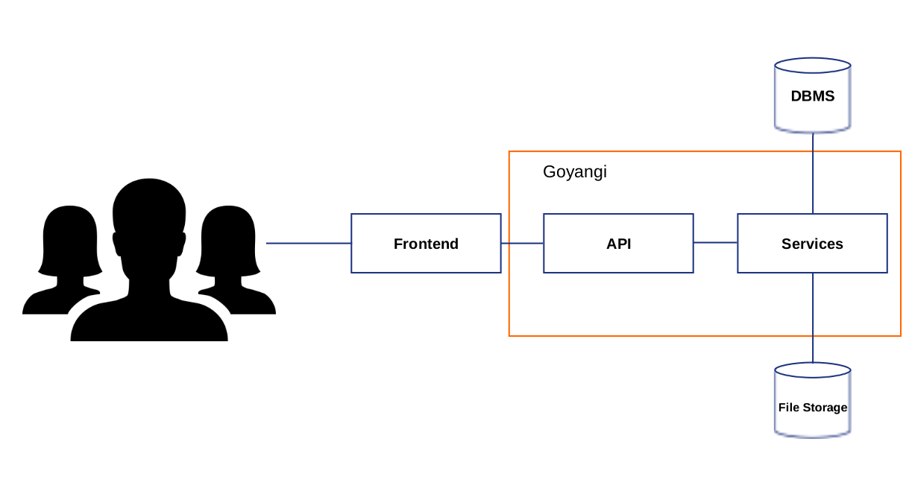
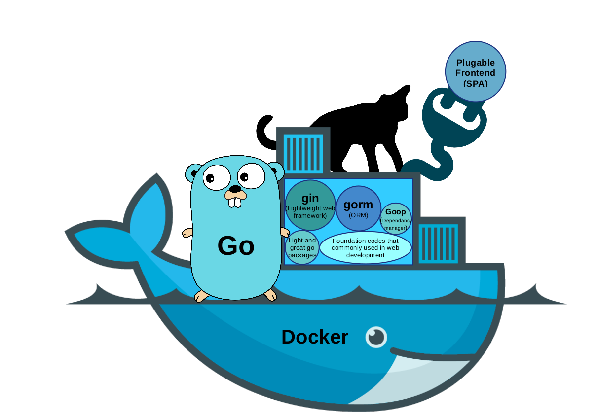

# [Goyangi](http://dorajistyle.net/goyangi)

Goyangi is a web foundation to help you getting started with a new web project based on Golang. It suits for you who want to develop SPA or mobile application.
It also good example how to develop large web application that combined fancy golang packages. [Goyangi](http://en.wikipedia.org/wiki/goyangi) means cat in Korean.

## Why?
There are some good frameworks like a magic([Beego](http://beego.me/), [Revel](http://revel.github.io/)...). However these are too much.  
Some of developers prefer to using micro frameworks and lightweight packages for flexibility and performance.  
It's not easy to select and combine packages though.  
So, Goyangi carefully chosen packages and combined.

## The goal
Develop foundation codes that commonly used in web development.  
Keep it simple and DRY.  
Help creative lazybones.

## How it works?

## Stack

## Demo
[Demo Server](http://168.235.151.141:6060/)

## Installation

### Pre installation
Mercurial
Go

### With Docker
~~~
$ go get github.com/nitrous-io/goop
$ git clone dorajistyle/goyangi
$ cd goyangi
$ goop install
$ docker build -t "dorajistyle/goyangi" --no-cache .
~~~

### Without Docker
`update soon`

### Configuration

### Backend
You can find all configuration files in ./config

* api.go : API related configuration.
* authentication.go : Authentication related configuration.
* aws.go : If you want to use aws S3, you should setup configuration here.
* db.go : Be sure that you have a database for migration and run application.
* email.go : If you want to send an email to users, set your email information.
* environment.go : It has three type of environments. DEVELOPMENT | TEST | PRODUCTION
* frontend.go : Frontend related configuration.
* guid.go : Guid for build frontend. Use guid in the static url to ignore cache.
* image.go : Image related configuration.
* logger.go : Log related configuration.
* oauth.go : When you want to connect with oauth, set your oauth information.
* order.go : Ordering of models.
* pagination.go : Pagination of models.
* public.go : Public fields of user for privacy.
* uploader.go : Uploader related configuration.

### Frontend

#### canjs

##### ./frontend/canjs/compiler

~~~
$ gulp
~~~
It generates views.build.js from *.stache files. Also it generates css files and merges into application.css from *.scss file.

~~~
$ gulp watch
~~~
It watches *.stache files and *.scss files. When these files are modified, It generate views.build.js and application.css

~~~
$ node ./r.js -o build.js
~~~
It runs requirejs optimize and generate optimized files into ./frontend/canjs/static-build
You can use this for production environment.

##### ./frontend/canjs/static/js/*.js

###### settings.js
If you want to use share article to facebook, set your facebook app Id to exports.facebookAppId

###### app.js
If you want to use google map, set your key into googlemaps/params/key

## Features
* Restful support
* From Development to Deployment
* SPA ready

### Restful API

#### User
User is core of web application.
- [x] User CRUD
- [x] User Authentication
- [x] Oauth
- [x] User role for admin
- [x] Permissions handling to access each API
- [x] Email verification
- [x] Password reset via email
- [x] Following
- [x] Activation
- [x] MD5 for Gravatar
- [ ] Messaging

#### Article
It's a foundation of basic board.
- [x] Article CRUD
- [x] Liking
- [x] Comment

#### Location
It's a foundation of basic location.
- [x] Location CRUD
- [x] Liking
- [x] Comment
- [x] Search on a google map
- [ ] Search on a other maps likes open street map.

#### Upload
It's a foundation of basic file upload.
- [x] Upload files to local storage
- [x] Upload files to amazon aws S3
- [x] Upload files meta data to database
- [ ] Upload files to other cloud server
- [ ] Upload csv to database

##### Image
Image handling included in uploads function.
- [x] Resize (vips)
- [x] Filtering (gift)

#### Statistics
It's a foundation of statistics.
- [ ] ???

#### Whatever you need
It's a foundation of Whatever you need
- [ ] You can add any foundation code that commonly used in web application.

### From Development to Deployment

#### Development
- [x] watcher for backend golang
~~~
  goop exec watcher server
~~~
- [x] wathcer for frontend
~~~
  goop exec go run goyangi.go watcher
~~~

#### Testing
- [x] BDD testing
~~~
   goop exec go run goyangi.go test
~~~

#### Deployment
- [x] Generate API document
~~~
   goop exec go run goyangi.go generateAPI
~~~
- [x] Dockerfile
You can find dockerfiles in ./dockerFiles

### SPA ready
Goyangi separates server and frondend clearly. And default SPA frontend used canjs.  
However developer can change the frontend easily. Just develop frontend and put it into 'frontend/'.

### Packages
Goyangi uses great open source packages. You can check that which packages used in Goyangi web foundation.

#### [Go Packages](./document/packages/backend.md)

#### [Frontend Packages](./document/packages/frontend.md)

### TODO
* [ ] Add tons of BDD tests
* [ ] Improve documentation
* [ ] Automatically ignore private configuration when commit using git filter for contributors.

### Contributing
Just fork it, and enhance it.  
When the Goyangi become more stable, developers become lazybones.  
And then lazybones become creative.

### Donation
<a href="https://gratipay.com/dorajistyle" rel="gratipay" target="_blank">
